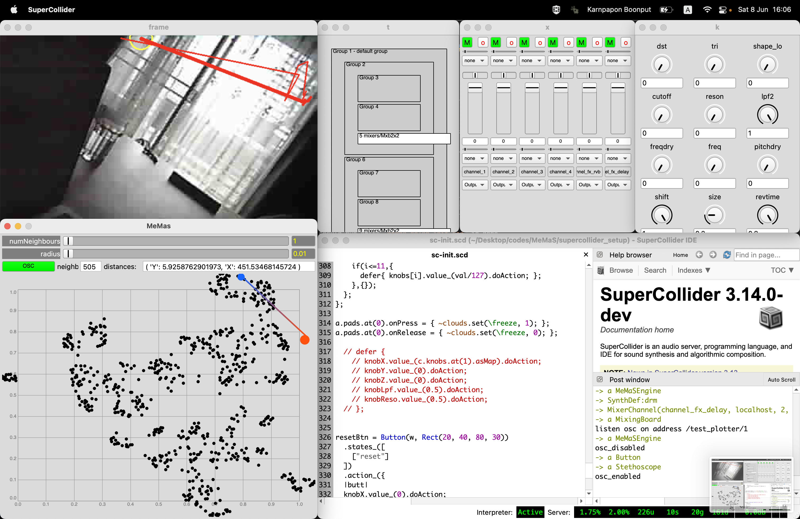
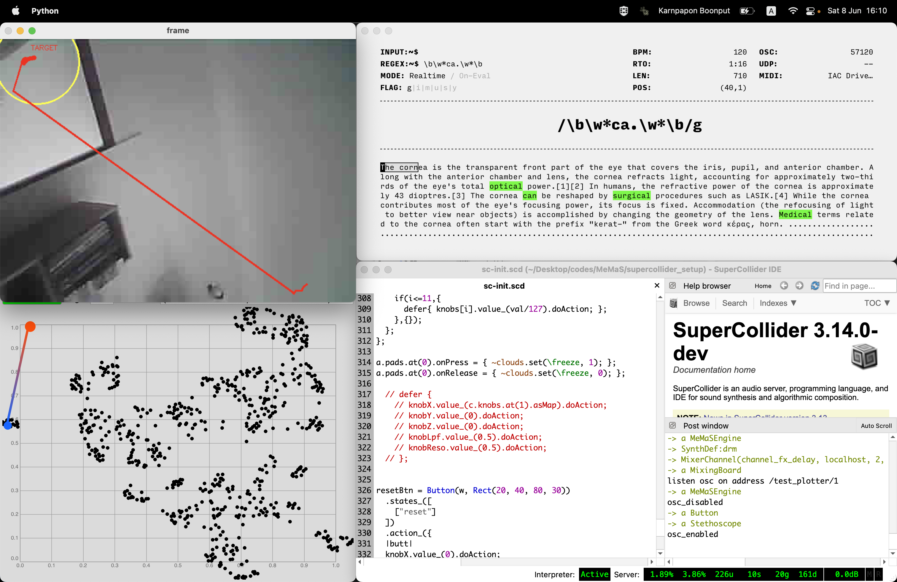

## MeMaS 

MeMaS, (`/'mɛm-mə/`) (MEta-Manifold Audiovisual System), a set of tools for exploring a connection between image and sound, utilising computer vision with [ corpus-based concatinative synthesis ](https://ieeexplore.ieee.org/document/4117932)

- `/memas_sc`: a SuperCollider extension.
- `/python_cam_tracker`: a Python tool for tracking target by `OpenCV`
- `/esp32_setup`: setup [esp32-camera](https://th.cytron.io/c-camera-image-sensor/p-esp32-cam-wireless-iot-vision-development-board) (the easiest way is using `Arduino IDE`)
- `/supercollider_setup`: setup SC for live-performance  ([please install required libraries](#prerequisites))

## prerequisites

some library can be installed easily with [`quarks`](https://doc.sccode.org/Guides/UsingQuarks.html)

- [`cruciallib`](https://github.com/supercollider-quarks/cruciallib), ( install via [`quarks`](https://doc.sccode.org/Guides/UsingQuarks.html) ).
- [`FluCoMa`](https://github.com/flucoma/flucoma-sc/releases/tag/1.0.7) library for SuperCollider.
- [`ddwMixerChannel`](https://github.com/jamshark70/ddwMixerChannel) audio mixer library.
- [`mi-UGens`](https://github.com/v7b1/mi-UGens/releases/tag/v0.0.6) a [Mutable Instrument](https://modulargrid.net/e/vendors/view/160) ported to SC.
- [`ArturiaBeatStep`](https://github.com/davidgranstrom/ArturiaBeatStep), midi controller interface for `Arturia BeatStep`.

## quickstart
- `cd python_cam_tracker && python3 main.py`, to start ESP32-camera (default osc configs are `--ip 127.0.0.1` and `--port 57120`) 
- - it'll send osc msg (`x` and `y` coord immediately (ranges are normalized to `0.0 - 1.0`) )
- - **NOTE**: currently osc's path is hardcoded as `/test_plotter/1` (rework soon)
- start `memas_sc`, by evaluating each blocks in `memas_sc/sc_init.scd` 
- - **OPTIONAL**: `memas_sc/ndef.scd` should run after `memas_sc/sc_init.scd` is done.
- click `OSC` button in SuperCollider's window (`MeMasEngine`) to start receiving osc msg from `ESP32`
- for step-sequencer please see [`anu`](https://github.com/karnpapon/anu)

## notes
- `export PYTHONPATH=.`, expose port so python can find relative path   
- `python3 algo/warp_perspective_video.py --video resources/pp2.mp4`, test example

## resources
- esp32+opencv: https://www.digikey.com/en/maker/projects/esp32-cam-python-stream-opencv-example/840608badd0f4a5eb21b1be25ecb42cb
